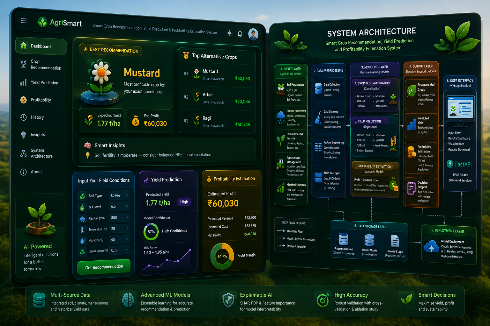

# 🌾 Ensemble Learning Framework for Crop Recommendation and Yield Forecasting Using Multi-Source Agricultural Data

<p align="center">
  
</p>

## 📖 Abstract

Agriculture plays a vital role in ensuring food security and economic sustainability. However, selecting suitable crops and accurately forecasting agricultural yield remain challenging due to variations in climate, soil conditions, irrigation availability, and environmental factors. This project presents an **Ensemble Learning Framework for Crop Recommendation and Yield Forecasting Using Multi-Source Agricultural Data**.

The proposed system integrates machine learning, ensemble learning, feature engineering, profitability assessment, and explainable artificial intelligence (XAI) techniques to support data-driven agricultural decision-making. Multiple machine learning models including Random Forest, Extra Trees, XGBoost, LightGBM, CatBoost, and ensemble architectures are employed for crop recommendation and yield prediction tasks. The framework further incorporates SHAP-based explainability, profitability estimation, and ablation studies to ensure transparency and reliability.

---

# 🎯 Objectives

The primary objectives of this project are:

- Recommend the most suitable crop based on soil, climate, and environmental conditions.
- Predict crop yield using historical agricultural data.
- Estimate agricultural profitability based on predicted yield and market price.
- Improve prediction performance through ensemble learning techniques.
- Provide interpretable recommendations using Explainable AI (SHAP).
- Support sustainable and data-driven agricultural planning.

---

# 🚀 Key Features

## 🌱 Smart Crop Recommendation

- Multi-class crop recommendation system
- Top alternative crop suggestions
- Confidence-based prediction
- Ensemble learning approach

## 📈 Yield Prediction

- Crop yield forecasting
- Regression-based prediction models
- Historical trend analysis
- Productivity estimation

## 💰 Profitability Assessment

- Revenue estimation
- Cost-benefit analysis
- Profit forecasting
- Economic decision support

## 🧠 Explainable AI

- SHAP Summary Plot
- Feature Importance Analysis
- Partial Dependence Plots (PDP)
- Model transparency

## 📊 Advanced Evaluation

- 5-Fold Cross Validation
- Ablation Study
- Runtime Analysis
- Overfitting Detection
- Feature Selection Analysis

---

# 🏗️ System Architecture

The proposed framework consists of seven major layers:

### 1. Input Layer

Agricultural inputs collected from multiple sources:

- Soil Parameters
- Climate Parameters
- Environmental Factors
- Agricultural Management Factors
- Historical Yield Records

### 2. Data Preprocessing Layer

- Data Collection
- Missing Value Treatment
- Outlier Detection
- Data Cleaning
- Feature Encoding
- Normalization

### 3. Feature Engineering Layer

Engineered features include:

- Nutrient Ratio
- Climate Index
- Soil Health Index
- Water Availability Index
- NPK Ratio
- Rainfall–Temperature Interaction
- Soil Moisture Index
- Fertilizer Interaction
- Climate Risk Index

### 4. Modeling Layer

#### Crop Recommendation (Classification)

- Random Forest
- Extra Trees
- XGBoost
- LightGBM
- CatBoost
- Ensemble Models

#### Yield Prediction (Regression)

- Random Forest Regressor
- Extra Trees Regressor
- Gradient Boosting Regressor
- XGBoost Regressor
- LightGBM Regressor
- CatBoost Regressor
- Neural Network (PyTorch)

### 5. Output Layer

- Recommended Crop
- Top Alternative Crops
- Predicted Yield
- Profitability Assessment
- Decision Support Insights

### 6. Data Storage Layer

- Processed Dataset
- Trained Models
- Reports
- Prediction Logs

### 7. Deployment Layer

- FastAPI Backend
- React Frontend
- REST API Services

---

# 📂 Dataset Description

The framework utilizes a multi-source agricultural dataset containing:

| Attribute | Description |
|------------|------------|
| Total Records | 1623 |
| Districts | 30 |
| Time Period | 2015–2025 |
| Crop Classes | Multiple Crop Categories |
| Soil Features | N, P, K, pH, Fertility Index |
| Climate Features | Rainfall, Temperature, Humidity |
| Environmental Features | Weather Score, Rainfall Score |
| Management Features | Irrigation, Fertilizer Usage |
| Target Variables | Crop Type, Yield |

### Record Construction

Each dataset record represents a **District–Crop–Season–Year** agricultural observation created by integrating soil characteristics, climatic variables, crop production statistics, irrigation information, and management practices from multiple agricultural data sources. The merged dataset provides a comprehensive representation of agricultural conditions affecting crop productivity.

---

# ⚙️ Feature Engineering

The framework generates several domain-specific features:

```python
Nutrient_Ratio
Climate_Index
Soil_Health
Water_Index
NPK_Ratio
Rainfall_Temperature_Index
Soil_Moisture_Index
Fertilizer_Interaction
Climate_Risk_Index
Water_Availability_Index
```

These features enhance predictive performance and improve model interpretability.

---

# 🤖 Machine Learning Models

## Classification Models

| Model |
|---------|
| Random Forest |
| Extra Trees |
| XGBoost |
| LightGBM |
| CatBoost |
| Voting Ensemble |
| Weighted Voting |
| Stacking Ensemble |
| Blended Ensemble |

---

## Regression Models

| Model |
|---------|
| Random Forest Regressor |
| Extra Trees Regressor |
| Gradient Boosting Regressor |
| XGBoost Regressor |
| LightGBM Regressor |
| CatBoost Regressor |
| Neural Network |

---

# 🔍 Hyperparameter Optimization

The framework uses **Optuna** for automated hyperparameter optimization.

Optimized parameters include:

- Number of Estimators
- Learning Rate
- Tree Depth
- Regularization Parameters
- Subsample Rate
- Feature Sampling Rate

---

# 📊 Explainable AI

## SHAP Analysis

SHAP (SHapley Additive Explanations) is used to:

- Identify influential features
- Interpret model predictions
- Improve transparency

### Outputs

- SHAP Summary Plot
- Feature Importance Plot
- Global Feature Ranking

---

## Partial Dependence Analysis

PDP visualizations illustrate:

- Feature interactions
- Non-linear relationships
- Marginal feature effects

---

# 🧪 Model Validation

The proposed framework incorporates:

### Cross Validation

- 5-Fold Cross Validation

### Overfitting Analysis

- Train Score
- Test Score
- Overfitting Gap

### Ablation Study

Experiments conducted on:

- Soil Features Only
- Climate Features Only
- Soil + Climate Features
- Full Feature Set

### Runtime Analysis

Training time comparison across all models.

---

# 💻 Technology Stack

## Programming Language

- Python 3.x

## Machine Learning

- Scikit-Learn
- XGBoost
- LightGBM
- CatBoost
- PyTorch
- Optuna

## Data Processing

- Pandas
- NumPy

## Visualization

- Matplotlib
- Seaborn
- SHAP

## Backend

- FastAPI

## Frontend

- React.js
- JavaScript
- HTML5
- CSS3

---

# 📁 Project Structure

```text
Ensemble-Learning-Framework/
│
├── dataset/
│
├── frontend/
│
├── backend/
│
├── models/
│   ├── crop_model.pkl
│   ├── yield_model.pkl
│   ├── encoder.pkl
│   └── scaler.pkl
│
├── results/
│   ├── shap_summary_classification.png
│   ├── shap_summary_regression.png
│   ├── confusion_matrix.png
│   ├── crop_metrics.json
│   ├── yield_metrics.json
│   └── ablation_study.csv
│
├── assets/
│   └── system_overview.png
│
├── requirements.txt
│
└── README.md
```

---

# ⚡ Installation

Clone the repository:

```bash
git clone https://github.com/yourusername/agri-smart-framework.git
```

Move into the project directory:

```bash
cd agri-smart-framework
```

Install dependencies:

```bash
pip install -r requirements.txt
```

---

# ▶️ Running the Project

## Backend

```bash
uvicorn app:app --reload
```

---

## Frontend

```bash
npm install
npm run dev
```

---

# 📈 Expected Outputs

The system generates:

- Recommended Crop
- Top Alternative Crops
- Predicted Yield
- Estimated Revenue
- Estimated Profit
- SHAP Explanations
- Decision Support Insights

---

# 🔮 Future Scope

- Satellite Image Integration
- IoT Sensor Data Integration
- Real-Time Weather APIs
- Deep Learning Models
- Mobile Application Development
- Precision Agriculture Support
- GIS-Based Agricultural Mapping

---

# 👨‍💻 Author

**Shaik Hidayathulla**

Department of Computer Science and Engineering

---

# 🎓 Mentor

**Dr. Ishapathik Das**

Department of Mathematics & Statistics

---

# 📄 Citation

If you use this work in your research, please cite:

```bibtex
@article{hidayathulla2025agrismart,
  title={Ensemble Learning Framework for Crop Recommendation and Yield Forecasting Using Multi-Source Agricultural Data},
  author={Shaik Hidayathulla and Ishapathik Das},
  year={2025}
}
```

---

# 📜 License

This project is developed for academic and research purposes.

© 2025 Shaik Hidayathulla. All Rights Reserved.
